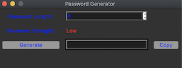
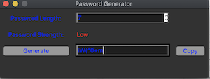
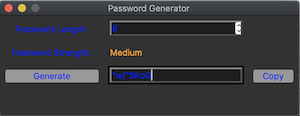
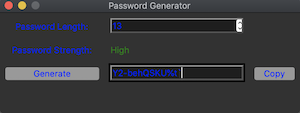

# Password Generator App
> Generates random passwords 


This desktop app is a password generator which generates random passwords between the length of 6-18.</br>
<p>If the length of the password is between 6-7, the password strength is 
<span style="red"><em>Low</em></span>.</p>
<p>If the length of the password is between 8-12, the password strength is 
<span style="color:orange"><em>Medium</em></span>.</p>
<p>If the length of the password is between 13-18, the password strength is 
<span style="color:green"><em>High</em></span>.</p>


  
 


## Usage
After cloning this repository , Please run the <code>main.py</code> in the cloned password_generator directory
```sh
python3 main.py
```
