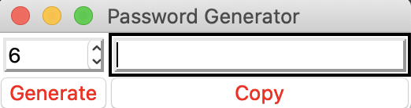
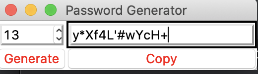

# password_generator App
> Generates random passwords 


This desktop app is a password generator which the length of the password can be between length 6 and 14.





## Installation

```sh
python3 main.py
```
## Usage
After cloning this repository , Please run the <code>main.py</code> in the cloned password_generator directory
